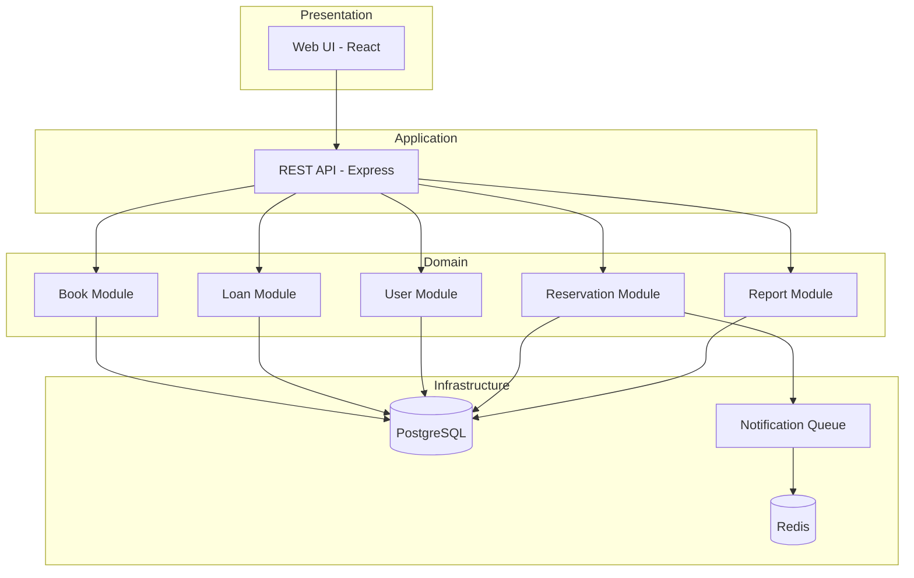
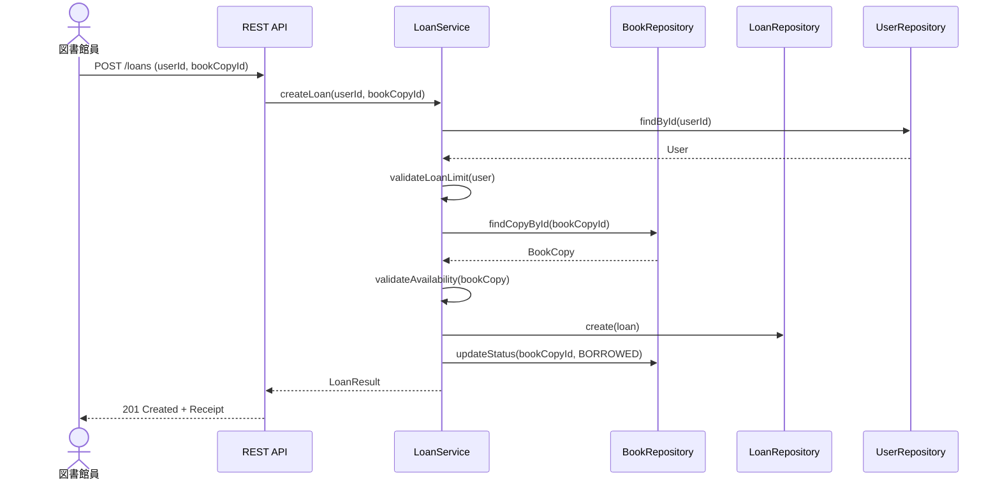
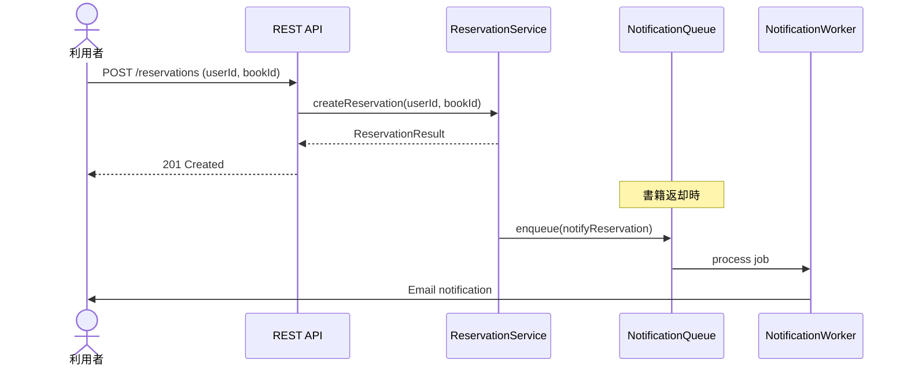
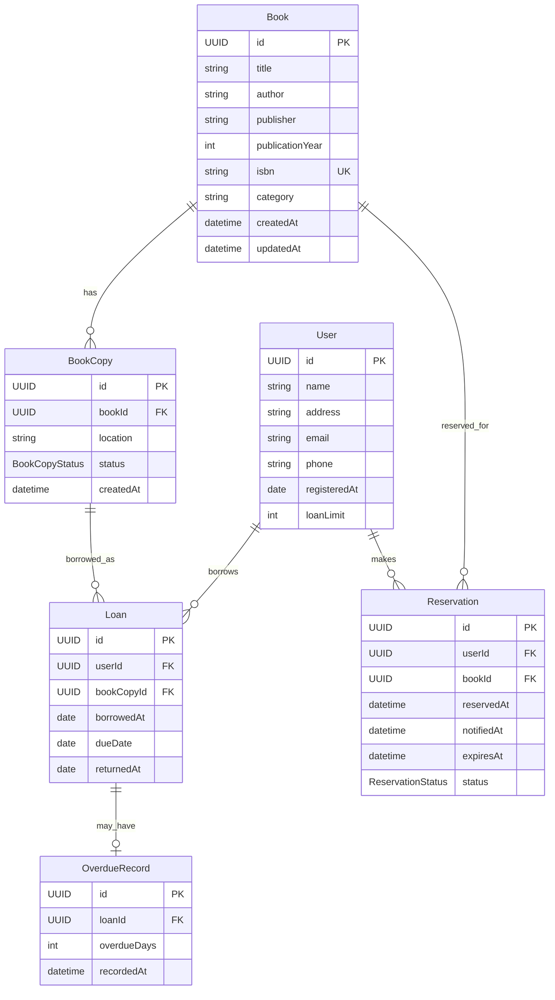

# Design Document: 図書館蔵書管理システム

## Overview

**Purpose**: 本システムは、図書館における蔵書の登録・管理・検索・貸出・返却業務を効率化し、利用者と図書館員双方の利便性を向上させる。

**Users**: 
- 図書館員: 蔵書登録、貸出・返却処理、利用者管理、レポート確認
- 利用者: 蔵書検索、予約リクエスト
- 図書館管理者: 統計レポート、システム設定

**Impact**: 紙ベースまたはレガシーシステムからの移行により、業務効率化と利用者サービス向上を実現する。

### Goals
- 蔵書情報の正確な管理と迅速な検索機能の提供
- 貸出・返却業務の効率化と履歴追跡
- 予約システムによる利用者サービス向上
- 統計データに基づく運営意思決定支援

### Non-Goals
- 電子書籍・デジタルコンテンツの配信機能
- 他図書館との相互貸借システム連携
- モバイルアプリ（初期スコープ外、Webレスポンシブで対応）
- 課金・罰金徴収システム

## Architecture

### Architecture Pattern & Boundary Map



**Architecture Integration**:
- **Selected pattern**: モジュラーモノリス（レイヤードアーキテクチャ + ドメイン分離）
- **Domain boundaries**: Book, Loan, User, Reservation, Report の5ドメインを独立モジュールとして分離
- **Rationale**: 中規模システムに適した複雑性、将来のマイクロサービス化パスを確保
- **Steering compliance**: 型安全性、明確な境界、テスタビリティを重視

### Technology Stack

| Layer | Choice / Version | Role in Feature | Notes |
|-------|------------------|-----------------|-------|
| Frontend | React 19 + TypeScript 5.9 | 管理画面UI、検索インターフェース | Vite でバンドル |
| Backend | Node.js 24 LTS (Krypton) + Express 5 | REST API サーバー | TypeScript で型安全性確保 |
| Data | PostgreSQL 16 | 蔵書・利用者・貸出データ永続化 | 全文検索機能活用 |
| Cache/Queue | Redis 8 | セッション管理、ジョブキュー | BullMQ でジョブ管理 |
| Infrastructure | Docker + Docker Compose | 開発・本番環境統一 | - |

## System Flows

### 貸出処理フロー



### 予約・通知フロー



## Requirements Traceability

| Requirement | Summary | Components | Interfaces | Flows |
|-------------|---------|------------|------------|-------|
| 1.1-1.5 | 蔵書登録・管理 | BookService, BookRepository | BookService, Book API | - |
| 2.1-2.5 | 蔵書検索 | SearchService, BookRepository | SearchService, Search API | - |
| 3.1-3.5 | 貸出管理 | LoanService, LoanRepository | LoanService, Loan API | 貸出処理フロー |
| 4.1-4.4 | 返却管理 | LoanService, LoanRepository | LoanService, Loan API | - |
| 5.1-5.5 | 利用者管理 | UserService, UserRepository | UserService, User API | - |
| 6.1-6.4 | 予約機能 | ReservationService, NotificationService | ReservationService, Reservation API | 予約・通知フロー |
| 7.1-7.4 | レポート・統計 | ReportService, ReportRepository | ReportService, Report API | - |

## Components and Interfaces

| Component | Domain/Layer | Intent | Req Coverage | Key Dependencies | Contracts |
|-----------|--------------|--------|--------------|------------------|-----------|
| BookService | Book/Application | 蔵書CRUD操作 | 1.1-1.5 | BookRepository (P0) | Service, API |
| SearchService | Book/Application | 蔵書検索処理 | 2.1-2.5 | BookRepository (P0) | Service, API |
| LoanService | Loan/Application | 貸出・返却処理 | 3.1-3.5, 4.1-4.4 | LoanRepository, BookRepository, UserRepository (P0) | Service, API |
| UserService | User/Application | 利用者管理 | 5.1-5.5 | UserRepository (P0) | Service, API |
| ReservationService | Reservation/Application | 予約管理 | 6.1-6.4 | ReservationRepository, NotificationService (P0) | Service, API |
| NotificationService | Notification/Infrastructure | 通知送信 | 6.2, 6.4 | Redis/BullMQ (P0), Nodemailer (P1) | Service |
| ReportService | Report/Application | 統計レポート生成 | 7.1-7.4 | ReportRepository (P0) | Service, API |

### Book Domain

#### BookService

| Field | Detail |
|-------|--------|
| Intent | 蔵書（書籍マスタ・蔵書コピー）のCRUD操作を提供 |
| Requirements | 1.1, 1.2, 1.3, 1.4, 1.5 |

**Responsibilities & Constraints**
- 書籍マスタと蔵書コピー（物理的な本）の管理
- ISBN形式バリデーション（ISBN-10/13）
- 必須項目（タイトル、著者、ISBN）の検証

**Dependencies**
- Outbound: BookRepository — データ永続化 (P0)
- External: ISBN Validator — ISBN検証ライブラリ (P1)

**Contracts**: Service [x] / API [x]

##### Service Interface
```typescript
interface BookService {
  createBook(input: CreateBookInput): Promise<Result<Book, BookError>>;
  updateBook(id: BookId, input: UpdateBookInput): Promise<Result<Book, BookError>>;
  deleteBook(id: BookId): Promise<Result<void, BookError>>;
  getBookById(id: BookId): Promise<Result<Book, NotFoundError>>;
  createBookCopy(bookId: BookId, input: CreateCopyInput): Promise<Result<BookCopy, BookError>>;
  updateCopyStatus(copyId: CopyId, status: BookCopyStatus): Promise<Result<BookCopy, BookError>>;
}

type BookError = 
  | { type: 'VALIDATION_ERROR'; field: string; message: string }
  | { type: 'DUPLICATE_ISBN'; isbn: string }
  | { type: 'NOT_FOUND'; id: string };
```

##### API Contract
| Method | Endpoint | Request | Response | Errors |
|--------|----------|---------|----------|--------|
| POST | /api/books | CreateBookRequest | Book | 400, 409 |
| PUT | /api/books/:id | UpdateBookRequest | Book | 400, 404 |
| DELETE | /api/books/:id | - | - | 404, 409 |
| GET | /api/books/:id | - | Book | 404 |
| POST | /api/books/:id/copies | CreateCopyRequest | BookCopy | 400, 404 |

### Loan Domain

#### LoanService

| Field | Detail |
|-------|--------|
| Intent | 貸出・返却処理と履歴管理 |
| Requirements | 3.1, 3.2, 3.3, 3.4, 3.5, 4.1, 4.2, 4.3, 4.4 |

**Responsibilities & Constraints**
- 貸出可否の検証（蔵書状態、利用者貸出上限）
- 返却期限の設定と延滞判定
- 貸出履歴の記録

**Dependencies**
- Outbound: LoanRepository, BookRepository, UserRepository — データアクセス (P0)

**Contracts**: Service [x] / API [x]

##### Service Interface
```typescript
interface LoanService {
  createLoan(input: CreateLoanInput): Promise<Result<Loan, LoanError>>;
  returnBook(loanId: LoanId): Promise<Result<ReturnResult, LoanError>>;
  getLoansByUser(userId: UserId): Promise<Result<Loan[], NotFoundError>>;
  getOverdueLoans(): Promise<Result<Loan[], never>>;
}

interface ReturnResult {
  loan: Loan;
  isOverdue: boolean;
  overdueDays?: number;
}

type LoanError =
  | { type: 'BOOK_NOT_AVAILABLE'; copyId: string }
  | { type: 'LOAN_LIMIT_EXCEEDED'; userId: string; limit: number }
  | { type: 'USER_NOT_FOUND'; userId: string }
  | { type: 'LOAN_NOT_FOUND'; loanId: string };
```

##### API Contract
| Method | Endpoint | Request | Response | Errors |
|--------|----------|---------|----------|--------|
| POST | /api/loans | CreateLoanRequest | Loan | 400, 404, 409 |
| POST | /api/loans/:id/return | - | ReturnResult | 404 |
| GET | /api/users/:userId/loans | - | Loan[] | 404 |

### Reservation Domain

#### ReservationService

| Field | Detail |
|-------|--------|
| Intent | 貸出中書籍の予約管理と通知連携 |
| Requirements | 6.1, 6.2, 6.3, 6.4 |

**Responsibilities & Constraints**
- 予約キューの管理（FIFO順序保証）
- 予約有効期限の管理（7日間）
- 返却時の自動通知トリガー

**Dependencies**
- Outbound: ReservationRepository, BookRepository — データアクセス (P0)
- Outbound: NotificationService — 通知送信 (P0)

**Contracts**: Service [x] / API [x]

##### Service Interface
```typescript
interface ReservationService {
  createReservation(input: CreateReservationInput): Promise<Result<Reservation, ReservationError>>;
  cancelReservation(reservationId: ReservationId): Promise<Result<void, ReservationError>>;
  processReturnedBook(bookId: BookId): Promise<Result<void, never>>;
  expireOverdueReservations(): Promise<Result<number, never>>;
}

type ReservationError =
  | { type: 'BOOK_AVAILABLE'; bookId: string }
  | { type: 'ALREADY_RESERVED'; userId: string; bookId: string }
  | { type: 'RESERVATION_NOT_FOUND'; reservationId: string };
```

### Notification Domain

#### NotificationService

| Field | Detail |
|-------|--------|
| Intent | 非同期通知の送信（メール） |
| Requirements | 6.2, 6.4 |

**Responsibilities & Constraints**
- 非同期ジョブキューによる通知処理
- 送信失敗時のリトライ（最大3回）
- 通知履歴の記録

**Dependencies**
- External: Redis/BullMQ — ジョブキュー (P0)
- External: Nodemailer — メール送信 (P1)

**Contracts**: Service [x]

##### Service Interface
```typescript
interface NotificationService {
  sendReservationAvailable(userId: UserId, bookId: BookId): Promise<Result<void, NotificationError>>;
  sendOverdueReminder(userId: UserId, loanId: LoanId): Promise<Result<void, NotificationError>>;
}
```

## Data Models

### Domain Model



### Logical Data Model

**Entities and Types**:

```typescript
type BookId = string & { readonly brand: unique symbol };
type CopyId = string & { readonly brand: unique symbol };
type UserId = string & { readonly brand: unique symbol };
type LoanId = string & { readonly brand: unique symbol };
type ReservationId = string & { readonly brand: unique symbol };

type BookCopyStatus = 'AVAILABLE' | 'BORROWED' | 'RESERVED' | 'MAINTENANCE';
type ReservationStatus = 'PENDING' | 'NOTIFIED' | 'FULFILLED' | 'EXPIRED' | 'CANCELLED';

interface Book {
  id: BookId;
  title: string;
  author: string;
  publisher: string | null;
  publicationYear: number | null;
  isbn: string;
  category: string | null;
  createdAt: Date;
  updatedAt: Date;
}

interface BookCopy {
  id: CopyId;
  bookId: BookId;
  location: string;
  status: BookCopyStatus;
  createdAt: Date;
}

interface User {
  id: UserId;
  name: string;
  address: string | null;
  email: string;
  phone: string | null;
  registeredAt: Date;
  loanLimit: number;
}

interface Loan {
  id: LoanId;
  userId: UserId;
  bookCopyId: CopyId;
  borrowedAt: Date;
  dueDate: Date;
  returnedAt: Date | null;
}

interface Reservation {
  id: ReservationId;
  userId: UserId;
  bookId: BookId;
  reservedAt: Date;
  notifiedAt: Date | null;
  expiresAt: Date | null;
  status: ReservationStatus;
}
```

**Indexing Strategy**:
- `books.isbn`: UNIQUE インデックス
- `books.title, books.author`: GIN インデックス（全文検索用）
- `book_copies.book_id, book_copies.status`: 複合インデックス
- `loans.user_id, loans.returned_at`: 複合インデックス（アクティブ貸出検索用）
- `reservations.book_id, reservations.status`: 複合インデックス

## Error Handling

### Error Strategy
- **Validation First**: 入力バリデーションをサービス層入口で実行
- **Result Type**: 成功/失敗を明示的に表現する `Result<T, E>` パターン採用
- **Domain Errors**: ビジネスルール違反は型付きエラーとして表現

### Error Categories and Responses
| Category | HTTP Status | Examples | Response Strategy |
|----------|-------------|----------|-------------------|
| Validation | 400 | 必須項目未入力、ISBN形式不正 | フィールド別エラーメッセージ |
| Not Found | 404 | 書籍・利用者が存在しない | リソース種別と ID を返却 |
| Conflict | 409 | ISBN重複、貸出中書籍の再貸出 | 競合理由の説明 |
| Business Rule | 422 | 貸出上限超過、貸出可能書籍の予約 | ルール説明とガイダンス |
| Server Error | 500 | DB接続エラー、外部サービス障害 | エラーID記録、ユーザーには汎用メッセージ |

## Testing Strategy

### Unit Tests
- BookService: ISBN バリデーション、CRUD 操作
- LoanService: 貸出可否判定、延滞計算
- ReservationService: 予約キュー順序、有効期限判定
- SearchService: 検索クエリ構築、ソート処理

### Integration Tests
- 貸出フロー: 利用者認証 → 書籍確認 → 貸出作成 → 状態更新
- 返却フロー: 返却処理 → 延滞判定 → 予約通知トリガー
- 予約フロー: 予約作成 → 返却検知 → 通知送信

### E2E Tests
- 図書館員: 蔵書登録 → 検索 → 貸出 → 返却
- 利用者: 検索 → 詳細表示 → 予約
- 管理者: レポート表示 → CSV出力

## Security Considerations

- **認証**: セッションベース認証（Redis セッションストア）
- **認可**: ロールベースアクセス制御（図書館員、利用者、管理者）
- **入力検証**: すべてのAPIエンドポイントで入力バリデーション実施
- **SQLインジェクション対策**: パラメータ化クエリの使用
- **XSS対策**: React の自動エスケープ + CSP ヘッダー

## Performance & Scalability

- **検索性能**: PostgreSQL GIN インデックスによる高速全文検索
- **接続プール**: pg-pool による DB 接続管理（max: 20）
- **キャッシュ**: 頻繁にアクセスされる書籍詳細を Redis キャッシュ（TTL: 1h）
- **非同期処理**: 通知送信はジョブキューで非同期実行
