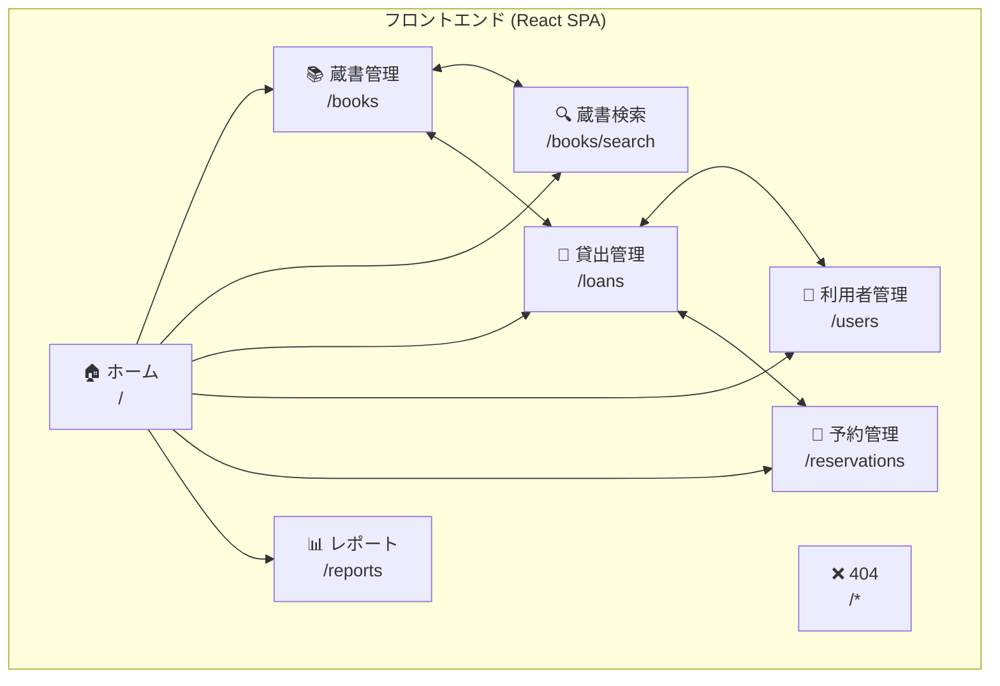

# 図書館蔵書管理システム

図書館の蔵書、貸出、予約、利用者を統合管理するフルスタックWebアプリケーション

## 概要

本システムは、図書館業務をデジタル化し効率化するために設計されています。
図書館員は蔵書の登録・管理、利用者情報の管理、貸出・返却処理を行うことができ、
利用者は蔵書の検索や予約を行うことができます。

### 対象ユーザー

- **図書館員**: 蔵書・利用者・貸出の管理
- **システム管理者**: ユーザー権限管理、レポート閲覧

## 主要機能

- 🏷️ **蔵書管理** - 書籍マスタと蔵書コピーのCRUD操作
- 📚 **貸出管理** - 貸出・返却処理、貸出状況追跡
- 📅 **予約管理** - 予約受付・管理、順番待ち対応
- 👥 **利用者管理** - 図書館利用者の登録・管理
- 🔍 **検索機能** - タイトル・著者・ISBNによる検索
- 📊 **レポート** - 統計・レポート生成
- 🔔 **通知機能** - 予約通知、延滞リマインダー

> 📖 **詳細な要件定義**: [.kiro/specs/library-inventory-system/requirements.md](.kiro/specs/library-inventory-system/requirements.md)

## 技術スタック

### バックエンド

| カテゴリ | 技術 | バージョン | 用途 |
|----------|------|------------|------|
| 言語 | TypeScript | 5.x | 型安全な開発（strict mode） |
| ランタイム | Node.js | 20+ | サーバーサイド実行環境 |
| フレームワーク | Express | 5.x | REST API サーバー |
| データベース | PostgreSQL | 16 | リレーショナルDB |
| キャッシュ/キュー | Redis | 8 | セッション管理、ジョブキュー |
| ジョブキュー | BullMQ | - | 非同期ジョブ処理（通知等） |

### フロントエンド

| カテゴリ | 技術 | バージョン | 用途 |
|----------|------|------------|------|
| 言語 | TypeScript | 5.x | 型安全な開発（strict mode） |
| UIライブラリ | React | 19 | コンポーネントベースUI |
| バンドラー | Vite | 7.x | 高速ビルド・HMR |
| ルーティング | React Router | 7.x | クライアントサイドルーティング |
| サーバー状態管理 | TanStack Query | 5.x | データフェッチ・キャッシュ |

### 開発環境・品質管理

| カテゴリ | 技術 | 用途 |
|----------|------|------|
| テスト | Vitest | ユニット・統合テスト |
| リンター | ESLint | コード品質チェック |
| フォーマッター | Prettier | コード整形 |
| コンテナ | Docker Compose | PostgreSQL/Redis のローカル環境 |
| 開発環境 | Dev Container | 統一された開発環境 |

## アーキテクチャ

本システムは**モノレポ構成**を採用し、**ドメイン駆動設計 + レイヤードアーキテクチャ**で構築されています。

```
┌─────────────────────────────────────────────────────┐
│                    Client (React SPA)                │
└─────────────────────┬───────────────────────────────┘
                      │ HTTP/REST
┌─────────────────────▼───────────────────────────────┐
│                  Backend (Express API)               │
├─────────────────────────────────────────────────────┤
│  Controller → Service → Repository → Infrastructure │
└─────────────────────────────────────────────────────┘
         │                              │
    ┌────▼────┐                   ┌─────▼─────┐
    │PostgreSQL│                   │   Redis   │
    └──────────┘                   └───────────┘
```

### 画面遷移図



| パス | ページ | 機能 |
|------|--------|------|
| `/` | ホーム | ダッシュボード、各機能へのナビゲーション |
| `/books` | 蔵書管理 | 書籍・蔵書コピーのCRUD |
| `/books/search` | 蔵書検索 | タイトル・著者・ISBN検索 |
| `/loans` | 貸出管理 | 貸出・返却処理 |
| `/users` | 利用者管理 | 利用者登録・検索 |
| `/reservations` | 予約管理 | 予約一覧・キャンセル |
| `/reports` | レポート | 統計・CSV出力 |

### 設計原則

| パターン | 概要 |
|----------|------|
| Result パターン | 例外を使わない明示的なエラーハンドリング |
| Branded Types | `BookId`, `UserId` 等でプリミティブ型の誤用を防止 |
| 依存性注入 | ファクトリ関数でテスタビリティを確保 |

> 📖 **詳細なアーキテクチャ設計**: [.kiro/specs/library-inventory-system/design.md](.kiro/specs/library-inventory-system/design.md)
>
> 📖 **技術選定の背景**: [.kiro/specs/library-inventory-system/research.md](.kiro/specs/library-inventory-system/research.md)

## 前提条件

| ツール | バージョン | 確認コマンド | 用途 |
|--------|------------|--------------|------|
| VS Code | 最新 | - | エディタ |
| Docker Desktop | 24 以上 | `docker -v` | コンテナ環境 |
| Dev Containers 拡張 | 最新 | - | VS Code 拡張 |

> 💡 Node.js や npm は Dev Container 内に含まれているため、ローカルへのインストールは不要です。

## セットアップ

本プロジェクトは **Dev Container** を使用して開発環境を構築します。

### 手順

1. **リポジトリをクローン**
   ```bash
   git clone https://github.com/DaisukeAsada/cc-sdd-trial.git
   code cc-sdd-trial
   ```

2. **Dev Container で開く**
   - VS Code でフォルダを開く
   - 右下の通知「Reopen in Container」をクリック
   - または、コマンドパレット（`F1`）→ `Dev Containers: Reopen in Container`

3. **コンテナ起動を待つ**
   - 初回は Docker イメージのビルドに数分かかります
   - 依存関係（npm install）は自動でインストールされます
   - **PostgreSQL と Redis も自動で起動**します

4. **開発サーバーを起動**
   ```bash
   # バックエンド
   npm run dev

   # フロントエンド（別ターミナル）
   cd client && npm run dev
   ```

> 💡 **ポイント**: データベースの手動起動は不要です。Dev Container 起動時に PostgreSQL・Redis が自動的に起動されます。

### 動作確認

セットアップ完了後、以下にアクセスして動作を確認：

| サービス | URL | 備考 |
|----------|-----|------|
| フロントエンド | http://localhost:5173 | Vite 開発サーバー |
| バックエンドAPI | http://localhost:3000 | Express サーバー |
| ヘルスチェック | http://localhost:3000/health | API 動作確認 |
| PostgreSQL | localhost:5432 | DB 接続 |
| Redis | localhost:6379 |

## スクリプト

### クイックスタート

最もよく使うコマンド：

```bash
# 開発を始める
npm run dev                # バックエンド起動
cd client && npm run dev   # フロントエンド起動（別ターミナル）

# テストを実行
npm test                   # watch mode
npm run test:run           # 単発実行
```

> 💡 Dev Container では PostgreSQL・Redis が自動起動されるため、DB の手動起動は不要です。

### バックエンド（ルートディレクトリ）

#### 開発

| コマンド | 説明 | 使用タイミング |
|----------|------|----------------|
| `npm run dev` | 開発サーバー起動 | 開発時 |
| `npm run build` | TypeScript ビルド | デプロイ前 |
| `npm start` | プロダクション実行 | 本番環境 |

#### テスト

| コマンド | 説明 | 使用タイミング |
|----------|------|----------------|
| `npm test` | テスト実行（watch mode） | 開発中の継続実行 |
| `npm run test:run` | テスト実行（単発） | CI/CD、コミット前 |

#### コード品質

| コマンド | 説明 | 使用タイミング |
|----------|------|----------------|
| `npm run lint` | ESLint チェック | コミット前 |
| `npm run lint:fix` | ESLint 自動修正 | エラー修正時 |
| `npm run format` | Prettier 整形 | コード整形 |

### フロントエンド（client/）

#### 開発

| コマンド | 説明 | 使用タイミング |
|----------|------|----------------|
| `npm run dev` | Vite 開発サーバー起動 | 開発時 |
| `npm run build` | プロダクションビルド | デプロイ前 |
| `npm run preview` | ビルド結果のプレビュー | ビルド確認 |

#### テスト・品質

| コマンド | 説明 | 使用タイミング |
|----------|------|----------------|
| `npm test` | テスト実行（watch mode） | 開発中 |
| `npm run test:run` | テスト実行（単発） | CI/CD |
| `npm run lint` | ESLint チェック | コミット前 |

## プロジェクト構成

### ディレクトリ構造

```
/
├── src/                        # バックエンド（Express API）
│   ├── domains/                # ドメイン層
│   │   ├── book/               # 蔵書ドメイン
│   │   ├── loan/               # 貸出ドメイン
│   │   ├── reservation/        # 予約ドメイン
│   │   ├── user/               # 利用者ドメイン
│   │   ├── auth/               # 認証ドメイン
│   │   ├── report/             # レポートドメイン
│   │   └── notification/       # 通知ドメイン
│   ├── infrastructure/         # インフラ層（DB接続など）
│   ├── shared/                 # 共通ユーティリティ
│   └── e2e/                    # E2Eテスト
├── client/                     # フロントエンド（React SPA）
│   └── src/
│       ├── components/         # 再利用可能コンポーネント
│       ├── pages/              # ページコンポーネント
│       ├── routes/             # ルーティング設定
│       ├── contexts/           # React Context（認証など）
│       ├── lib/                # APIクライアント等
│       └── test/               # テスト設定
├── .devcontainer/              # Dev Container 設定
├── .kiro/                      # AI開発支援設定
├── docker-compose.yml          # PostgreSQL/Redis 設定
├── package.json                # バックエンド依存関係
├── tsconfig.json               # TypeScript 設定
├── eslint.config.mjs           # ESLint 設定
└── vitest.config.ts            # Vitest 設定
```

### ドメインモジュール構成

各ドメイン（例: `src/domains/book/`）は以下の標準構成を持ちます：

| ファイル | 役割 |
|----------|------|
| `types.ts` | エンティティ、入力/出力型、エラー型 |
| `*-service.ts` | ビジネスロジック |
| `*-repository.ts` | データアクセスインターフェース |
| `*-controller.ts` | REST API エンドポイント |
| `*.test.ts` | テストファイル（ソースと同階層） |
| `index.ts` | バレルエクスポート（公開API） |

### フロントエンドモジュール構成

| ディレクトリ | 役割 |
|--------------|------|
| `components/` | 再利用可能なUIコンポーネント（DataTable, Alert等） |
| `pages/` | ルートに対応するページ（BooksPage, UsersPage等） |
| `routes/` | React Router ルーティング定義 |
| `contexts/` | グローバル状態管理（認証Context等） |
| `lib/` | ユーティリティ、APIクライアント |

### 設定ファイル

| ファイル | 役割 |
|----------|------|
| `package.json` | 依存関係、スクリプト定義 |
| `tsconfig.json` | TypeScript コンパイラ設定 |
| `eslint.config.mjs` | ESLint ルール設定 |
| `vitest.config.ts` | テストフレームワーク設定 |
| `.devcontainer/` | Dev Container 設定（Docker Compose 含む） |

## 環境変数

> 💡 **Dev Container 使用時**: 環境変数は自動設定されるため、通常は設定不要です。

### データベース（PostgreSQL）

| 変数名 | 説明 | デフォルト値 |
|--------|------|-------------|
| `POSTGRES_USER` | ユーザー名 | `library_user` |
| `POSTGRES_PASSWORD` | パスワード | `library_password` |
| `POSTGRES_DB` | データベース名 | `library_db` |
| `POSTGRES_HOST` | ホスト | `postgres` |
| `POSTGRES_PORT` | ポート | `5432` |

### キャッシュ/キュー（Redis）

| 変数名 | 説明 | デフォルト値 |
|--------|------|-------------|
| `REDIS_HOST` | ホスト | `redis` |
| `REDIS_PORT` | ポート | `6379` |

### アプリケーション

| 変数名 | 説明 | デフォルト値 |
|--------|------|-------------|
| `NODE_ENV` | 実行環境 | `development` |
| `PORT` | APIサーバーポート | `3000` |

### ⚙️ カスタマイズ

環境変数を変更する場合は、プロジェクトルートに `.env` ファイルを作成してください：

```bash
# .env
POSTGRES_PASSWORD=your_secure_password
PORT=4000
```

### ⚠️ 本番環境での注意

- **パスワード**: `POSTGRES_PASSWORD` は必ず強力なパスワードに変更してください
- **シークレット管理**: `.env` ファイルは `.gitignore` に追加し、リポジトリにコミットしないでください
- **安全な管理**: 本番環境では環境変数を安全な方法（シークレット管理サービス等）で管理してください

## 開発ガイドライン

### 命名規則

| 対象 | 規則 | 例 |
|------|------|-----|
| ファイル名 | kebab-case | `book-service.ts`, `user-repository.ts` |
| 型/インターフェース | PascalCase | `BookService`, `CreateBookInput` |
| 関数 | camelCase | `createBookService`, `validateISBN` |
| 定数 | UPPER_SNAKE_CASE | `MAX_LOAN_LIMIT`, `DEFAULT_TIMEOUT` |
| テストファイル | `<source>.test.ts` | `book-service.test.ts` |

### コード規約

#### TypeScript

- strict mode 有効（`tsconfig.json` で設定済み）
- すべての公開関数に明示的な戻り値型を指定
- エンティティ/入力型のプロパティは `readonly`
- `any` 型の使用禁止
- `noUncheckedIndexedAccess` 有効

#### エラーハンドリング

- 例外は投げず `Result<T, E>` 型で成功/失敗を表現
- 各ドメインに専用のエラー型を定義（`BookError`, `LoanError` 等）

### インポート順序

```typescript
// 1. 外部モジュール
import { Router } from 'express';

// 2. 共有モジュール
import { Result, isOk } from '../../shared/result.js';

// 3. 同一ドメイン内モジュール
import type { BookService } from './book-service.js';
```

### ブランチ戦略

| ブランチ | 用途 |
|----------|------|
| `main` | 本番環境にデプロイ可能な状態 |
| `feature/*` | 新機能開発 |
| `fix/*` | バグ修正 |
| `docs/*` | ドキュメント更新 |

### コミットメッセージ

```
<type>: <subject>

例:
feat: 蔵書検索機能を追加
fix: 貸出上限チェックのバグを修正
docs: README にセットアップ手順を追加
test: BookService のユニットテストを追加
refactor: LoanService のエラーハンドリングを改善
```

## テスト

### テスト戦略

| 種類 | 対象 | 方針 |
|------|------|------|
| ユニットテスト | Service, Repository | 依存をモックして単体機能を検証 |
| 統合テスト | Controller | 実際のService/Repositoryを使用 |
| コンポーネントテスト | React Components | Testing Library でUI動作を検証 |

### テストファイル配置

テストファイルはソースファイルと**同じディレクトリ**に配置します：

```
src/domains/book/
├── book-service.ts
├── book-service.test.ts    # ← 同階層に配置
├── book-controller.ts
└── book-controller.test.ts
```

### テスト実行

```bash
# バックエンドテスト（watch mode）
npm test

# バックエンドテスト（単発実行）
npm run test:run

# フロントエンドテスト
cd client && npm test

# 特定ファイルのみ実行
npm test -- book-service
```

### テストの書き方

```typescript
import { describe, it, expect, vi } from 'vitest';

describe('BookService', () => {
  it('should return book when found', async () => {
    // Arrange: モックの準備
    const mockRepo = { findById: vi.fn().mockResolvedValue(ok(mockBook)) };
    const service = createBookService(mockRepo);

    // Act: テスト対象の実行
    const result = await service.findById(bookId);

    // Assert: 結果の検証
    expect(result.ok).toBe(true);
    expect(result.value).toEqual(mockBook);
  });
});
```

## ライセンス

このプロジェクトは [ISC License](https://opensource.org/licenses/ISC) の下で公開されています。

## コントリビューション

コントリビューションを歓迎します！

### 貢献の流れ

1. **Issue を確認** - 既存の Issue を確認するか、新しい Issue を作成
2. **フォーク** - リポジトリをフォーク
3. **ブランチ作成** - `feature/機能名` または `fix/バグ名` でブランチ作成
4. **開発** - コードを変更し、テストを追加
5. **確認** - lint とテストが通ることを確認
   ```bash
   npm run lint
   npm run test:run
   ```
6. **コミット** - [コミットメッセージ規約](#コミットメッセージ)に従ってコミット
7. **プルリクエスト** - `main` ブランチに向けて PR を作成

### PR チェックリスト

- [ ] テストを追加/更新した
- [ ] `npm run lint` がエラーなしで通る
- [ ] `npm run test:run` がすべて通る
- [ ] コミットメッセージが規約に従っている

### Issue・PR

- 🐛 バグ報告: [Issues](https://github.com/DaisukeAsada/cc-sdd-trial/issues)
- 💡 機能リクエスト: [Issues](https://github.com/DaisukeAsada/cc-sdd-trial/issues)
- 📝 プルリクエスト: [Pull Requests](https://github.com/DaisukeAsada/cc-sdd-trial/pulls)
